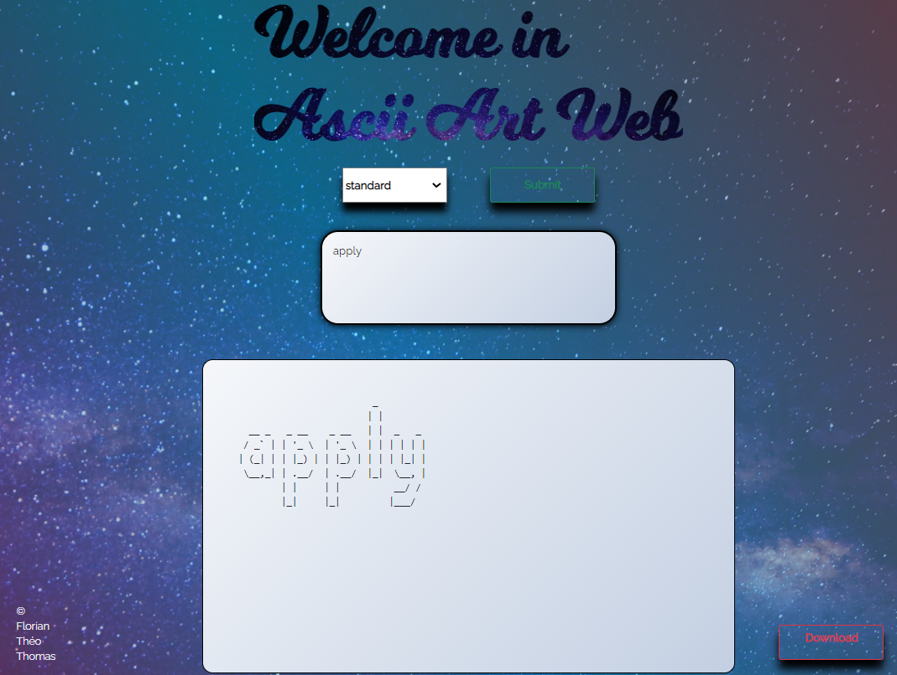
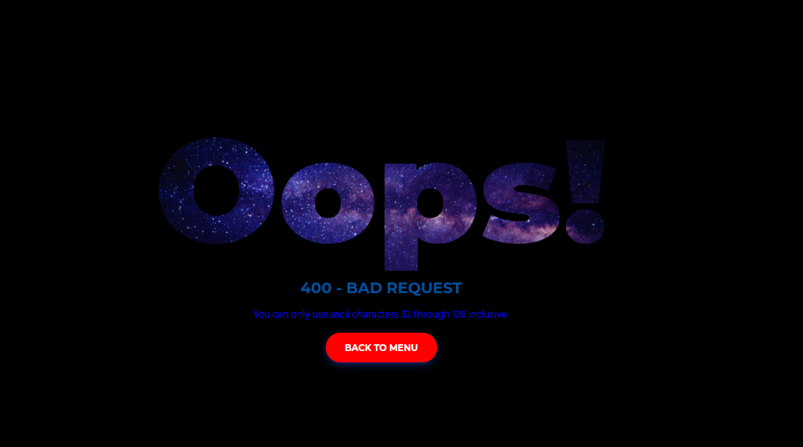

# ascii-art-web

 ## Presentation of the projects:
 ascii-art is a program that takes a character string as argument; it returns a graphical representation of the given characters, asccii-art web is the continue from asccii-art is intended to allow the online use of the basic program and these extensions (string=graphic representation) on web
 
 ## How to use it:
 ```
 git clone https://github.com/x33lyS/ascii-art-web.git
 
  go build main.go
 ```
 Click on the new main.exe
 
<br>
 </br>

## Ascii-art-web :
-There are four differents fonts you can use : "Standard", "Shadow", "Thinkertoy" and "Doom".

-Errors management:
```
-400: Bad Request
-404: Page Not Found, File Not Found
-500: Internal Server Error
```
<br>
 </br>

## The project was done collectively on git.

```
-Florian Lejosne

-Théo Moigne

-Thomas Marty 
```
